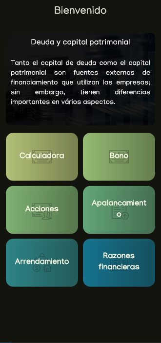
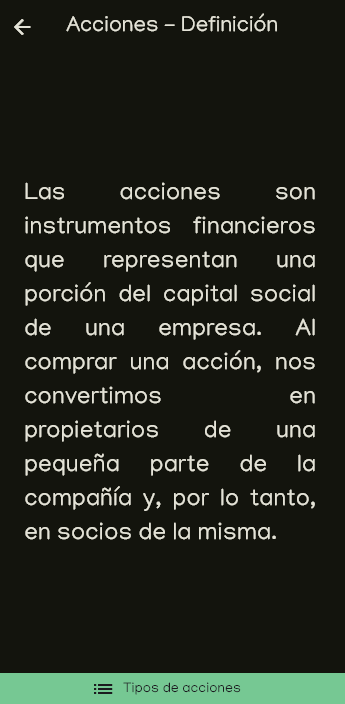
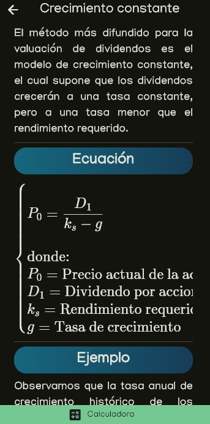
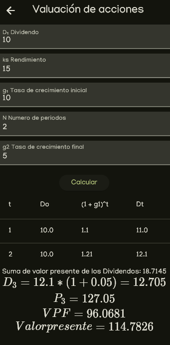

# Finance Pro: Aplicación de Educación Financiera

## Descripción
Esta aplicación es una herramienta educativa diseñada para ayudar a los usuarios a comprender conceptos básicos de finanzas. La app incluye explicaciones sencillas sobre temas esenciales como:

- **Bonos**
- **Acciones**
- **Apalancamiento**
- **Arrendamiento**
- **Razones Financieras**

Además de ofrecer información teórica, la app incluye una calculadora para que los usuarios puedan aplicar estos conceptos en cálculos prácticos y mejorar su comprensión de los mismos.

## Características Principales

- **Exploración de conceptos financieros**: Aprende los fundamentos de las finanzas a través de definiciones claras y ejemplos sencillos.
- **Calculadora de Finanzas**: Realiza cálculos financieros clave relacionados con cada concepto, como rendimiento de bonos, valor de acciones, ratios de apalancamiento, entre otros.

## Web live
[Link](https://hensell.github.io/finance_pro/)

## Screenshots

### Pantalla de bienvenida


### Definiciones de conceptos financieros


### Incluye formulas


### Calculadora financiera



## License

```
MIT License

Copyright (c) 2024 Hensell

Permission is hereby granted, free of charge, to any person obtaining a copy
of this software and associated documentation files (the "Software"), to deal
in the Software without restriction, including without limitation the rights
to use, copy, modify, merge, publish, distribute, sublicense, and/or sell
copies of the Software, and to permit persons to whom the Software is
furnished to do so, subject to the following conditions:

The above copyright notice and this permission notice shall be included in all
copies or substantial portions of the Software.

THE SOFTWARE IS PROVIDED "AS IS", WITHOUT WARRANTY OF ANY KIND, EXPRESS OR
IMPLIED, INCLUDING BUT NOT LIMITED TO THE WARRANTIES OF MERCHANTABILITY,
FITNESS FOR A PARTICULAR PURPOSE AND NONINFRINGEMENT. IN NO EVENT SHALL THE
AUTHORS OR COPYRIGHT HOLDERS BE LIABLE FOR ANY CLAIM, DAMAGES OR OTHER
LIABILITY, WHETHER IN AN ACTION OF CONTRACT, TORT OR OTHERWISE, ARISING FROM,
OUT OF OR IN CONNECTION WITH THE SOFTWARE OR THE USE OR OTHER DEALINGS IN THE
SOFTWARE.
```