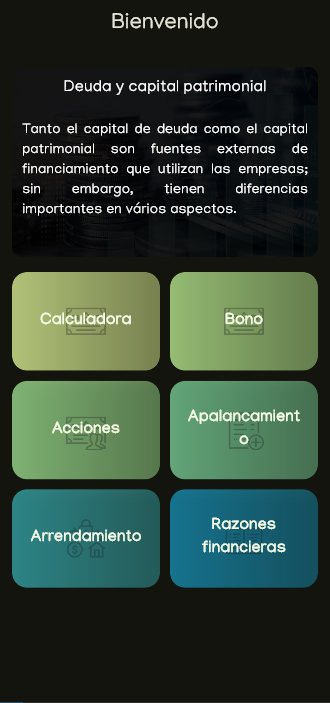
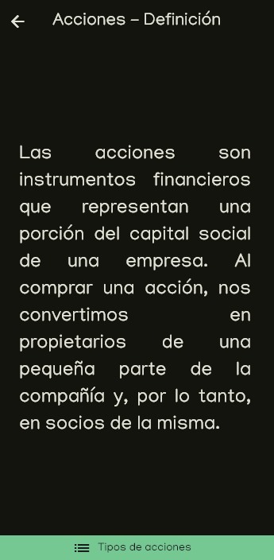
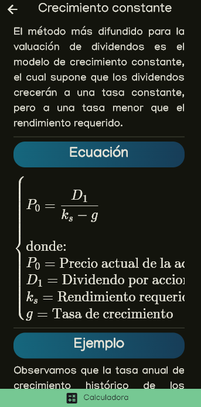
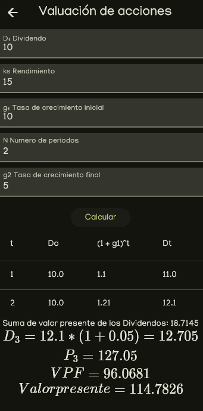

# Finance Pro

Aplicación educativa de finanzas corporativas construida con Flutter y enfocada en web. El proyecto fue rehecho sobre una arquitectura limpia para que el contenido, las fórmulas, las calculadoras y la UI sean más fáciles de mantener, probar y ampliar.

Originalmente, esta app fue creada como proyecto final para la clase de Finanzas II en la Universidad Nacional de Ingeniería de Nicaragua.

## Demo

- Web live: [https://hensell.github.io/finance_pro/](https://hensell.github.io/finance_pro/)

## Qué incluye

- Contenido educativo bilingüe: español e inglés.
- Fórmulas renderizadas con `flutter_tex`.
- Calculadoras guiadas para:
  - Bonos
  - Acciones
  - Apalancamiento
  - Arrendamiento financiero
  - Razones financieras
- Módulo de razones financieras con builder asistido de estado de resultados y balance general.
- Design system propio y navegación centralizada para web.

## Stack

- Flutter `>=3.41.0`
- Dart `>=3.11.0 <4.0.0`
- `flutter_bloc`
- `go_router`
- `freezed` / `json_serializable`
- `flutter_gen_l10n`
- `flutter_tex`
- `golden_toolkit`

## Arquitectura

El proyecto sigue una mezcla de:

- Clean Architecture
- Feature-first
- Atomic Design
- Design system con tokens centralizados

Estructura principal:

```text
lib/
  app/                bootstrap, router, theme, localization
  core/               utilidades, contenido base, assets, helpers compartidos
  design_system/      atoms, molecules, organisms, theme tokens
  features/           slices por dominio
    bonds/
    shares/
    leverage/
    lease/
    financial_ratios/
    home/
    onboarding/
    shared_content/
  l10n/
assets/content/
  es/
  en/
tool/
  build_github_pages.sh
```

Nota: todavía existen carpetas legacy como `lib/screens`, `lib/widgets`, `lib/services` y `lib/utils`. Ya no son la base activa del rediseño actual y deberían considerarse deuda técnica remanente.

## Localización y contenido

- Los textos de UI viven en `lib/l10n/*.arb`.
- El contenido docente por módulo vive en `assets/content/es/*.json` y `assets/content/en/*.json`.
- La app carga ese contenido desde repositorios locales tipados, en lugar de embutir teoría o fórmulas directamente en los widgets.

## Ejecutar en local

Desde la raíz del proyecto:

```bash
flutter pub get
flutter run -d chrome
```

Si prefieres servidor web en lugar de Chrome:

```bash
flutter run -d web-server
```

## Generación de código

Cuando cambien modelos `freezed`, `json_serializable` o localización:

```bash
dart run build_runner build --delete-conflicting-outputs
flutter gen-l10n
```

## Calidad y pruebas

Checks principales:

```bash
flutter analyze
flutter test
flutter build web
```

La suite incluye:

- tests de dominio por feature
- tests de validación y cubits
- widget tests de calculadoras
- parsing de contenido
- goldens para pantallas clave

## Build web

Build estándar:

```bash
flutter build web
```

Build preparado para GitHub Pages:

```bash
tool/build_github_pages.sh
```

Ese script:

- compila con `--base-href` correcto para el repo
- genera `build/web/404.html` para fallback de rutas SPA
- crea `build/web/.nojekyll`

## Deploy a GitHub Pages

El deploy se publica desde la rama `deploy` usando únicamente el contenido generado en `build/web`.

Flujo recomendado:

1. Generar el build para Pages:

```bash
tool/build_github_pages.sh
```

2. Copiar solo `build/web` a la rama `deploy`.

La configuración esperada de GitHub Pages es:

- Branch: `deploy`
- Folder: `/ (root)`

Si en producción ves errores `404` al cargar assets o al refrescar una ruta interna, normalmente significa una de estas dos cosas:

- el deploy fue publicado con un `base href` incorrecto
- falta publicar `404.html` para el fallback de la SPA

## Screenshots

### Bienvenida


### Contenido


### Fórmulas


### Calculadoras


## Licencia

```text
MIT License

Copyright (c) 2024 Hensell

Permission is hereby granted, free of charge, to any person obtaining a copy
of this software and associated documentation files (the "Software"), to deal
in the Software without restriction, including without limitation the rights
to use, copy, modify, merge, publish, distribute, sublicense, and/or sell
copies of the Software, and to permit persons to whom the Software is
furnished to do so, subject to the following conditions:

The above copyright notice and this permission notice shall be included in all
copies or substantial portions of the Software.

THE SOFTWARE IS PROVIDED "AS IS", WITHOUT WARRANTY OF ANY KIND, EXPRESS OR
IMPLIED, INCLUDING BUT NOT LIMITED TO THE WARRANTIES OF MERCHANTABILITY,
FITNESS FOR A PARTICULAR PURPOSE AND NONINFRINGEMENT. IN NO EVENT SHALL THE
AUTHORS OR COPYRIGHT HOLDERS BE LIABLE FOR ANY CLAIM, DAMAGES OR OTHER
LIABILITY, WHETHER IN AN ACTION OF CONTRACT, TORT OR OTHERWISE, ARISING FROM,
OUT OF OR IN CONNECTION WITH THE SOFTWARE OR THE USE OR OTHER DEALINGS IN THE
SOFTWARE.
```
